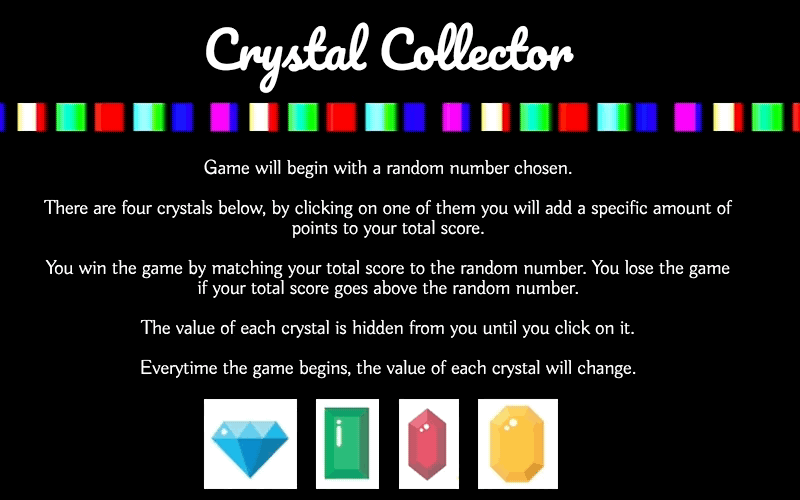

# Crystal Collector

In Crystal Collector the user will have four gem options, each assigned with a different value, the user should try to match the "Random Number" with the assigned gem values, if it matches, a win will be added, if else it goes over, user will start over.


## Getting Started

User will begin by having four different gems, each one will be assigned with a different value, user will not know what the said value is until clicked, after knowing the value, user should try and match the "Random Number: " portion with accumulated values.




### Want a Sneak Peak of the code? Well here you have it! 

Here we are giving each gem which are defined with the "img" tag, a value, the way we are getting this value is by running a built in function that is going to be choosing a random number between 1-12. These values will change everytime the page reloads, a win is added, or a loss is added.

```
  $("img").each(function () {
    $(this).attr("data-value", Math.floor(Math.random()*12) + 1);
  });
```


## Deployment

Check out the game here: [Crystal Collector](https://delgador28.github.io/CrystalC…) - Happy Sorting!


## Made With

* HTML
* CSS 
* Javascript
* jQuery


Thanks for checking out my work! Want to see all of it? Click [Here](https://github.com/Delgador28?tab=repositories)!